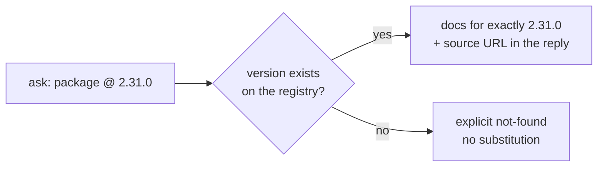

# scoutdocs-mcp

MCP server that fetches and **searches** current documentation for any package — the latest stable release by default, or one exact version on request. Keeps AI coding agents in sync with current APIs instead of relying on stale training data.

Two ways to run it:

- **Local stdio** (Python) — installs into Claude Code / Claude Desktop / Cursor, can read your project's manifests.
- **Hosted Worker** (Cloudflare) — public HTTPS endpoint at `/mcp`, no install required.

## Why

LLMs are trained on a snapshot — the docs they "know" may be months or years old. scoutdocs-mcp gives any MCP client live access to version info, READMEs, and search results across docs sites for packages on **PyPI**, **npm**, and **crates.io** — including exact-version lookups that never fall back to a different release.

## How it works

<p align="center">
  
</p>

## Tools

| Tool | Where | What it does |
|------|-------|--------------|
| `get_package_info` | local + hosted | Latest stable version + metadata; optional exact `version` |
| `get_package_docs` | local + hosted | README / long-description content; optional exact `version` |
| `search_package_docs` | local + hosted | Bounded discovery: docs URL, `llms.txt` / `llms-full.txt`, sitemap, same-host links — ranks pages by query match |
| `detect_project_dependencies` | local only | Reads pyproject/requirements/uv.lock, package.json/package-lock, Cargo.toml/Cargo.lock |
| `cache_stats` | local only | Local SQLite cache stats |

### Exact versions

Both doc tools take an optional exact `version`. The rule is simple: **served exactly, or not at all** — the latest release is never silently substituted.



```
> get_package_docs package="click" version="8.1.7"
```

The reply says what it is and where it came from:

```
# click v8.1.7 (python)
Version: exact (8.1.7)
License: BSD-3-Clause
Source: pypi_description (https://pypi.org/pypi/click/8.1.7/json)
Docs: https://click.palletsprojects.com/

---

$ click_
==========
Click is a Python package for creating beautiful command line interfaces…
```

What that buys you when a version matters:

- Unknown version → explicit "not found". Latest is never substituted.
- `version="latest"` is refused — pass a real version, or omit `version` to get latest stable.
- Cache entries are per-version: one version's docs are never served for another.
- On a pinned project, feed the `declared_version` from `detect_project_dependencies` into `version=` to read exactly what the project builds with.

> Exact versions work on **both servers** — the local install and the hosted endpoint.

## Quickstart

### Local (Python stdio)

`scoutdocs-mcp` is currently a beta (`0.2.0b4`), so pip and uv need to be told pre-releases are OK:

```bash
pip install --pre scoutdocs-mcp                # or
uv tool install --prerelease=allow scoutdocs-mcp
```

Add to Claude Code's MCP config (`~/.claude/claude_code_config.json`):

```json
{
  "mcpServers": {
    "scoutdocs": {
      "command": "uvx",
      "args": ["--prerelease", "allow", "--from", "scoutdocs-mcp", "scoutdocs-mcp"]
    }
  }
}
```

This runs the newest beta without pinning a version; change the `--from` value to `scoutdocs-mcp==0.2.0b4` if you'd rather freeze it. Once `scoutdocs-mcp` reaches `0.2.0` stable, the `--pre` / `--prerelease` flags go away. For Claude Desktop (`~/Library/Application Support/Claude/claude_desktop_config.json` on macOS), use the same JSON shape.

### Hosted (Cloudflare Worker)

Point any MCP client at the public Streamable HTTP endpoint:

```
https://scoutdocs-mcp.solmonger.workers.dev/mcp
```

The hosted endpoint is unauthenticated and rate-limited (60 MCP req/min, 10 search req/min per client IP). Search results are capped tighter than local (8 discovered pages × 18k chars / 200k total backstop) but well within Cloudflare free-tier headroom.

## Example prompts

```
> What's the latest version of flask?
> Show me the docs for the serde crate
> Show me the docs for requests 2.31.0 — the exact version my project pins
> Search the httpx docs for "transport"
> What dependencies does this project declare?
```

## Configuration

### GitHub token (optional, local only)

Unauthenticated GitHub API allows 60 req/hr. A token (any scope) raises that to 5,000/hr — useful when fetching READMEs in bulk:

```bash
export GITHUB_TOKEN=ghp_your_token_here
```

### Cache

- **Local stdio**: SQLite at `~/.cache/scoutdocs-mcp/cache.db`, 24h TTL.
- **Hosted Worker**: Cloudflare KV, same 24h TTL, scoped per binding.

### Search caps

The README is **always** included as a free first page. The `max_pages` cap
governs how many *discovered* pages we add on top of it.

| | Hosted | Local default |
|---|---|---|
| Discovered pages | 8 (max 20 via `max_pages` arg) | 15 (max 30 via `max_pages` arg) |
| Chars/page | 18,000 | 24,000 |
| Total backstop | 200,000 | 500,000 |

## Supported ecosystems

| Ecosystem | Registry | Aliases |
|-----------|----------|---------|
| Python | PyPI | `python`, `pypi`, `pip` |
| JavaScript / TypeScript | npm | `javascript`, `typescript`, `npm`, `js`, `ts` |
| Rust | crates.io | `rust`, `cargo`, `crate` |

If no ecosystem is specified, registries are tried in order.

## Repository layout

```
src/scoutdocs_mcp/    Python stdio server (published as scoutdocs-mcp)
worker/               Cloudflare Worker (TypeScript) for the hosted endpoint
tests/                pytest suite (mocked HTTP)
worker/test/          Vitest suite (Cloudflare workers pool)
docs/RELEASE.md       Release & deployment runbook
```

## Status

Beta (`0.2.0b4`). API stable; some discovery sources may evolve. Filed issues welcome at <https://github.com/eshaanmathakari/scoutdocs-mcp/issues>.

## License

MIT
